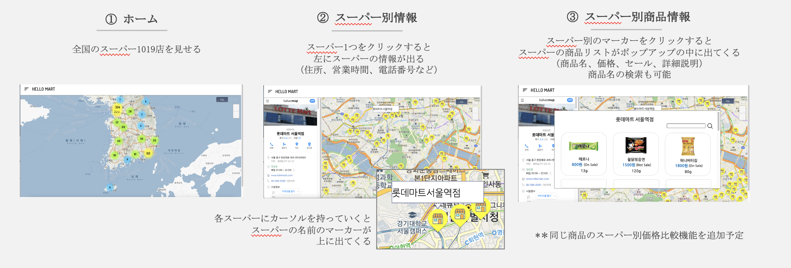
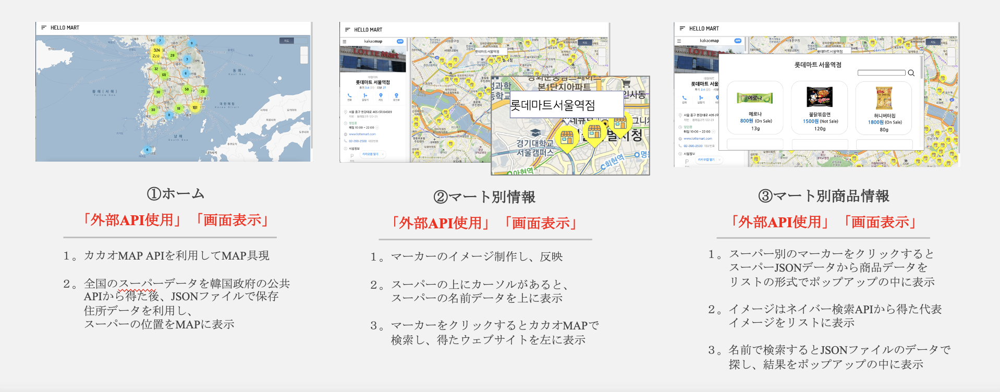

# Martome(マートまとめ)_Web
<h3>📍「サービス紹介」</h3>
韓国の全国スーパーの商品情報をまとめて提供するウェブサイトサービス 
 
 
<h3>📍「企画背景」</h3>
スーパーに直接行かなくても、事前に価格比較やセールの情報を知ることができるサービスは不在。 
人々がものを買う時、楽にオンラインでどんなスーパーの情報も得ることができる。
 
 
<h3>📍「使用技術」</h3>
<ul style="font-size: 25px;">
  <li>LANGUAGE : Javascript</li>
  <li>FRAMEWORK : Node.js</li>
  <li>SERVER : Express</li>
  <li>ENVIRONMENT : VS Code</li>
  <li>API : 韓国政府の公共データの全国マート別商品情報API、カカオMap API</li>
</ul>
 
<h3>📍「開発期間/人数」</h3>
2021年8月15日〜現在進行中 / 2人
 
 
<h3>📍「機能」</h3>
<ul style="font-size: 25px;">
  <li>スーパー別情報照会（住所、営業時間、電話番号など）</li>
  <li>スーパー別商品情報(商品名、価格、セール、詳細説明)</li>
  <li>スーパー別商品名検索</li>
</ul>
 
<h3>📍「サービスの詳細説明」</h3>

 
<h3>📍「担当した部分」</h3>
「Backend」 80% 「Frontend」 50%  

